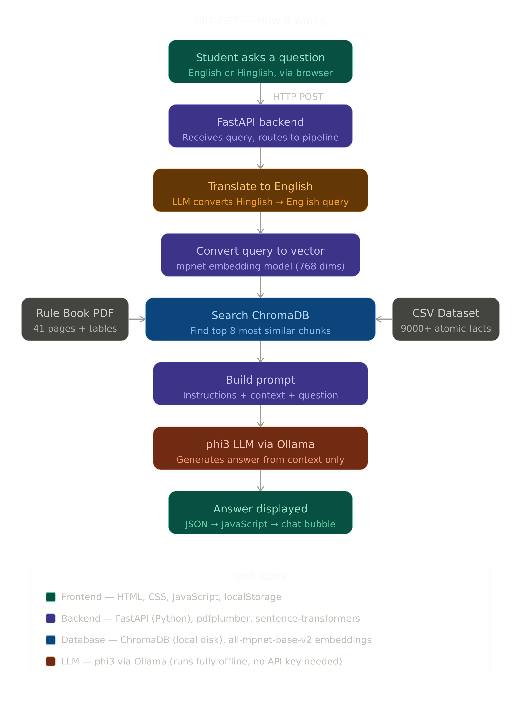

# KIIT-GPT 🎓 — AI-Powered Campus Assistant

KIIT-GPT is a Retrieval-Augmented Generation (RAG) chatbot designed specifically for KIIT University students. Instead of a generic AI that guesses answers, it retrieves real facts directly from the KIIT Rule Book and a curated dataset of 9,000+ university facts before generating a response — making every answer grounded, accurate, and hallucination-free. It runs entirely offline with no API key needed.

---

## 📸 System Architecture



---

## 🧠 What Problem Does It Solve?

Students at KIIT constantly need answers to questions like:

- "What is the minimum attendance required?"
- "What grade do I get for 75 marks?"
- "What are the hostel rules for first years?"
- "What is the average placement package?"

Finding these answers usually means digging through a 41-page rule book, asking seniors, or waiting on official responses. KIIT-GPT answers all of these instantly, in plain English — or even Hinglish.

---

## ✨ Features

- 🔍 **RAG Pipeline** — Retrieves exact facts from a 41-page KIIT Rule Book PDF and 9,000+ atomic facts from a curated CSV dataset before generating any answer
- 🌐 **Hinglish Support** — Automatically translates Hindi/Hinglish queries to English before retrieval so students can ask naturally
- 🧠 **Fully Offline LLM** — Powered by phi3 via Ollama; no API key, no internet, no cost
- 💬 **Persistent Chat History** — Multiple conversations saved in localStorage with search support
- 🎨 **Polished Dark UI** — Responsive cyber-green interface with sidebar, suggestion chips, and typing indicators
- ⚡ **Fast Responses** — Vector DB preloaded once at server startup; ChromaDB persisted to disk so rebuilding only happens once

---

## 🏗️ How It Works

```
Student Question (English / Hinglish)
        │
        ▼  HTTP POST
  FastAPI Backend
        │
        ▼
  Translate to English (phi3 LLM)
        │
        ▼
  Convert Query → Vector (all-mpnet-base-v2, 768 dims)
        │
        ▼
  Search ChromaDB ◄──── Rule Book PDF (41 pages + tables)
                  ◄──── CSV Dataset (9,000+ atomic facts)
        │
        ▼
  Build Prompt (instructions + context + question)
        │
        ▼
  phi3 LLM via Ollama (generates answer from context only)
        │
        ▼
  JSON → JavaScript → Chat Bubble
```

### Stack

| Layer | Technology |
|-------|-----------|
| Frontend | HTML, CSS, Vanilla JavaScript, localStorage |
| Backend | Python, FastAPI, Uvicorn |
| Embeddings | sentence-transformers/all-mpnet-base-v2 (768-dim) |
| Vector Store | ChromaDB (persisted to local disk) |
| LLM | phi3 via Ollama |
| PDF Parsing | pdfplumber (text + table extraction) |
| Data | KIIT Rule Book PDF + custom CSV dataset |

---

## 📁 Project Structure

```
kiit-gpt/
│
├── data/                       # Add your data files here (not included in repo)
│   ├── Rule_Book.pdf           # KIIT Rule Book — 41 pages
│   └── kiit_clean_dataset.csv  # 9,000+ atomic facts (topic, category, content)
│
├── images/
│   └── kiit_logo.png
│
├── vector_db/                  # Auto-generated on first run (not included in repo)
│
├── index.html                  # Main chat interface
├── style.css                   # Chat page styles
├── script.js                   # Chat logic — history, API calls, UI
│
├── about.html                  # About KIIT page
├── academic.html               # Academics page
├── placements.html             # Placements page
├── contact.html                # Contact page
├── home.html                   # Home / landing page
│
├── main_style.css              # Shared CSS design system
├── main_script.js              # Shared JS (mobile nav, scroll animations)
│
├── main.py                     # FastAPI server — /chat endpoint
├── rag_pipeline.py             # Full RAG pipeline (load → embed → retrieve → answer)
└── requirements.txt            # Python dependencies
```

---

## 🚀 Getting Started

### Prerequisites
- Python 3.10+
- Ollama installed and running

### 1. Clone the Repository
```bash
git clone https://github.com/ANJALI7203/KIIT-GPT.git
cd KIIT-GPT
```

### 2. Install Python Dependencies
```bash
pip install -r requirements.txt
```

### 3. Pull the LLM
```bash
ollama pull phi3
```

For better answer quality, switch to `llama3` by updating `main.py`:
```python
llm = ChatOllama(model="llama3")
```

### 4. Add Your Data Files
Place these in the `data/` folder:
```
data/
├── Rule_Book.pdf
└── kiit_clean_dataset.csv
```
The CSV must have three columns: `topic`, `category`, `content` (bullet points starting with `-`).

### 5. Start the Backend
```bash
uvicorn main:app --reload
```
The first run builds and saves the ChromaDB vector store — takes a few minutes. Every run after that loads it instantly from disk.

API is live at `http://127.0.0.1:8000`.

### 6. Open the Frontend
Open `index.html` in your browser, or serve it locally:
```bash
python -m http.server 5500
```
Visit `http://localhost:5500`.

---

## 🔌 API Reference

### POST `/chat`

**Request**
```json
{ "query": "What is the minimum attendance required at KIIT?" }
```

**Response**
```json
{ "answer": "The minimum attendance required at KIIT is 75%..." }
```

**Error**
```json
{ "detail": "Query cannot be empty." }
```

---

## 💡 RAG Pipeline — Key Design Decisions

**Atomic CSV facts** — Each bullet point in the CSV is stored as a separate document. This prevents the LLM from accidentally mixing unrelated facts (e.g. confusing hostel fees with laptop fees) — a common failure mode in naive RAG setups.

**Dual-query retrieval** — Both the original query and its English translation are used to search ChromaDB. Results are deduplicated and the top 8 are passed to the LLM, maximising recall for Hinglish inputs.

**Context-only generation** — The prompt explicitly instructs the LLM to answer only from the retrieved context and never invent information. If the answer isn't in the data, it says so.

**PDF table extraction** — pdfplumber extracts both text and structured tables from the Rule Book, converting table rows to pipe-separated text so tabular data (grade ranges, fee structures) is fully searchable.

---

## 🎨 Frontend Pages

| Page | File | Description |
|------|------|-------------|
| Chat | index.html | Main AI chat interface |
| Home | home.html | Landing page with university stats |
| About | about.html | About KIIT University |
| Academics | academic.html | Academic programs info |
| Placements | placements.html | Placement statistics |
| Contact | contact.html | Contact information |

All pages share `main_style.css` (design tokens, nav, footer) and `main_script.js` (mobile nav, scroll animations).

---

## ⚙️ Configuration

| Setting | File | Default |
|---------|------|---------|
| LLM model | main.py | phi3 |
| Retrieved chunks (k) | rag_pipeline.py | 8 |
| Chunk size | rag_pipeline.py | 1000 chars |
| Chunk overlap | rag_pipeline.py | 150 chars |
| Backend URL | script.js | http://127.0.0.1:8000/chat |

---

## 🛠️ Troubleshooting

**Cannot connect to backend** — Ensure `uvicorn main:app --reload` is running on port 8000.

**Slow first startup** — The vector DB is being built for the first time. This only happens once; all future startups are instant.

**Poor answer quality** — Switch from `phi3` to `llama3` in `main.py` for noticeably better responses.

**Hinglish query not understood** — The translation step uses the LLM; if it fails, the pipeline automatically falls back to the original query.

---

*Built with ❤️ for the KIIT Community · Kalinga Institute of Industrial Technology, Bhubaneswar*
